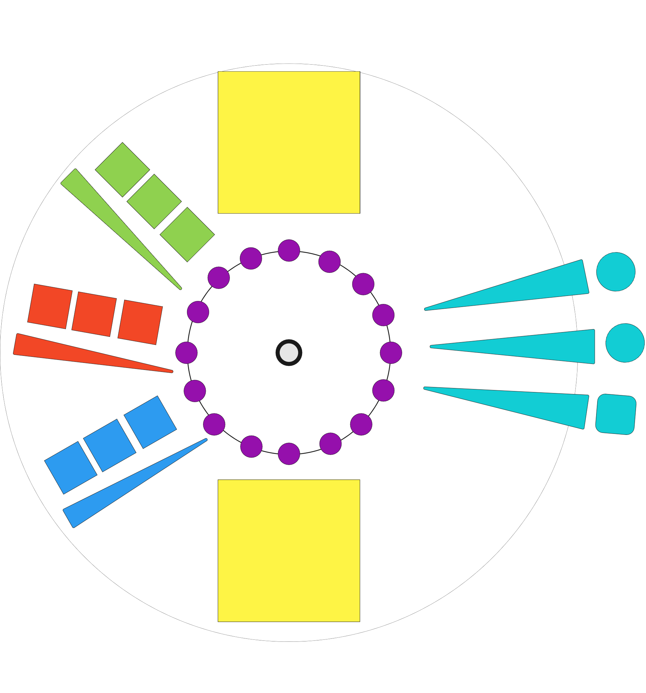
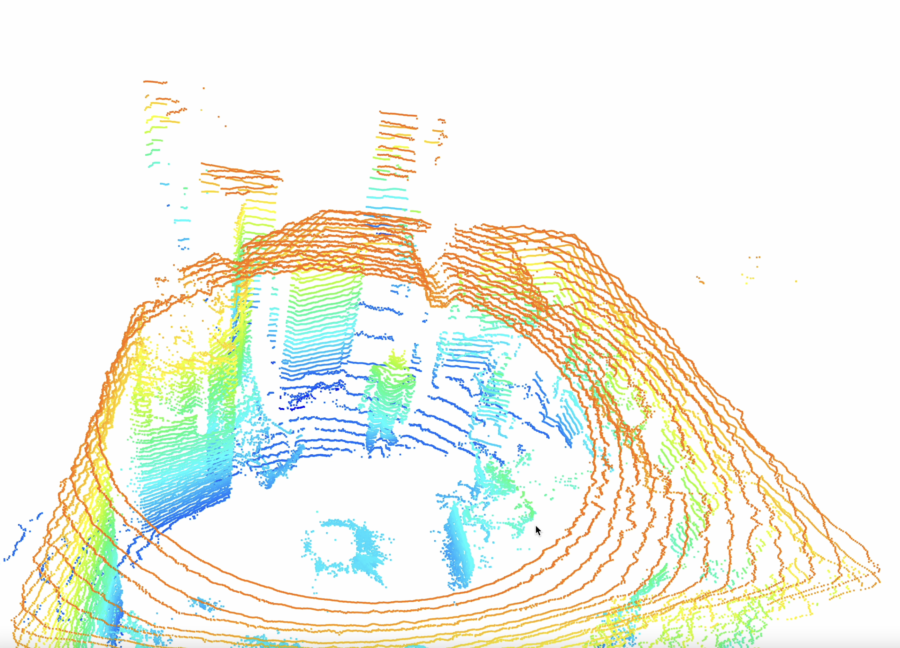
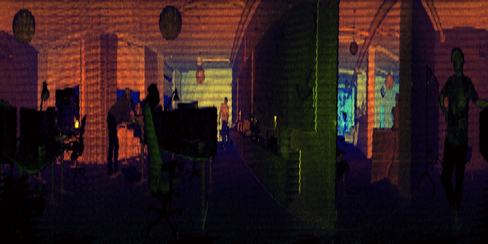

# XR-Synthesizer
The XR-Synthesizer is a exploration project to develop understanding how advanced technoligies could be combined to create an immersive experience. The project is based on the idea of a synthesizer that can be controlled by the user's body movements. The project has several parts; the virtual synthesizer created using TouchDesigner, the floor projections were created with Unreal Engine and the data collection and analysis created with Python. The project resultet in an prototyp using computer vision to track the user's body movements and control the synthesizer. The project is still in development and will hopefully be updated with new features and improvements.

This repository is the data collection and analysis part of the project and this README will explain how to use the code, how the data was collected and how the data is used to extract the 3D position of the user's body as well as how the current method was developed.
## Developer
This part of the project was developed by Theodor Jonsson, Umeå University, Sweden:
* [LinkedIn](https://www.linkedin.com/in/theodor-jonsson-32534b228/)
* [GitHub](https://www.github.com/Tottowich)

This does not include [train.py](train.py), [val.py](val.py), [export.py](export.py), [hubconf.py](hubconf.py), models/* and utils/.
Exception: modifications to [utils/dataloaders.py](utils/dataloaders.py). Specifically LoadImages to handle multiple directories as input.

But including all code in the [OusterTesting](https://github.com/adopticum/oustertesting.git) repository.

## Problem description
The problem needed to be solved was to detect the 3D positions and dimensions of each person surrounding the center of the so called playing field. 
The final design of the playing field:
<p align="center">
  
</p>
The white dot in the center represent the lidar sensor provided by Ouster, specifically Ouster OS0-128.

## Ouster [OS0-128](https://ouster.com/products/scanning-lidar/os0-sensor/)
This sensor is a high definition lidar sensor with 128 azimuth lasers rotating at 1200 rpm. At each rotaion the sensor collects 128 datapoints at 1024 different angles. The sensor is capable of collecting over 2 million data points per second. A typical point cloud from the sensor an OS0 sensor looks like this:
<!-- Center Image -->
<p align="center">
  
</p>

This image was taken from the [OS0-64](https://ouster.com/products/scanning-lidar/os0-sensor/) sensor with 64 azimuth lasers.
## 3D detection approach
The first approach to solve this problem was intuitivly use a 3D detection model to detect people from the raw point cloud.
We tried various 3D detection models. We primarly tested the [PointPillars](https://arxiv.org/abs/1812.05784) model. The model used was trained on the [NuScences Dataset](https://arxiv.org/abs/1903.11027) generating 3D bounding boxes around each person surrounding the sensor.
Unfourtenatly the model did not perform well on the raw point cloud from the Ouster sensor. The model was trained on a dataset with a different sensor and the point cloud from the Ouster sensor was not similar enough to the dataset used for training. The model was able to detect people but with alot of flickering and high rate of false positives.
## 2D detection approach
The second approach was to construct an image from the sensor generated data and use an 2D detection model trained in house. The problem with using this sort of technuiqe was that there was no data available. But forunatley we had a solution to this problem, collect roughly 1200 images and manually label each image in a room without air condition and 30+ degrees celcius in the middle of July! But resultingly we had a dataset with images from a variety of different sceneary and weather conditions:
<p align="center">
  
</p>
The images constructed by the sensor are not typicall RGB or BGR images but images with 3 channels containing 3 different types of information metrics for each point gathered by the sensor. The image above is constructed using the following channels:

* Channel 0: Signal - Represents the number of photons collected by the sensor at each point.
* Channel 1: Reflectivity - Represents the reflectivity of the object at each point.
* Channel 2: Range - Represents the distance from the sensor to the object at each point.

Read more about the various channels [here](https://ouster.com/blog/firmware-2-1-1-better-perception-performance-with-improved-reflectivity-and-signal-multiplier-mode/).
## Ouster Code
To help with recording data, play back sequences of data in python and to visualize the point clouds using [Open3D](http://www.open3d.org/) we created a extension of the [Ouster-SDK](https://pypi.org/project/ouster-sdk/) available at [Adopticums's](https://www.adopticum.se/sv-SE) [github](https://github.com/adopticum/OusterTesting). This code is used to collect the data used in this project. The repository also contains functions to contruct the image representations of the sensor data. These images has the dimensions 128x1024x3 when using the channels described above. The code also contains classes to visualize the point clouds using [Open3D](http://www.open3d.org/) along side 3D bounding boxes at real time.
## Data collection
The data was collected in on the streets of Skellefteå, Sweden and at [North Kingdoms](https://www.northkingdom.com) offices in Skellefteå and is available on [Roboflow](https://app.roboflow.com/lidarimages-9xnln/xr-synthesize-srr/6).

## Training
The training was done using [YoloV5](https://github.com/ultralytics/yolov5) and the training script provided via their repository.
The first training was done using the following the 6th version of the roboflow dataset and further fintuned on the 7th version where additional data of people in wheelchairs was added. The training was done on a Nvidia RTX 3090 GPU and took roughly 3 hours to train the first part and an additional 2 hours to train the second part. The hyper parameters used to train the model are available under [data/hyps/hyp.scratch-low.yaml](data/hyps/hyp.scratch-low.yaml) for the first part and [data/hyps/hyp.finetune-frozen.yaml](data/hyps/hyp.finetune-frozen.yaml) for the second part. To see the results of training the different models see my [wandb](https://wandb.ai/totto/YOLOR?workspace=user-totto).

## 2D to 3D
Since using a 2D detection models only creates a 2D bounding box around each person, we need to find a way to convert the 2D bounding box to a 3D bounding box using the depth map of the image, i.e. channel 2. To project the 2D detection into 3D some assumtions had to be made. The assumtions are:
* All people are equally deep as seen from the sensor. Some information is lost here but it is a good enough assumtion for the purpose of this project. All people are instead assumed to be 0.5 meters deep, see [HARD_WIDTH](tools/xr_synth_utils.py) where it is easily altered.
* The sensor is level with the ground. This is not always the case but it is a good enough assumtion for the purpose of this project.

Given these assumtions we can project the 2D bounding box into 3D by using the following formula:

$$w^{(i)} = \frac{u_1^{(i)}-u_0^{(i)}}{W}*2d\pi$$

$$h^{(i)} = \frac{v_1^{(i)}-v_0^{(i)}}{H}*2*\tan{\frac{a}{2}}*d\pi$$

$$x^{(i)} = \cos{(\frac{u_1+u_0}{2})}*d$$

$$y^{(i)} = \sin{(\frac{u_1+u_0}{2})}*d$$

Where $w^{(i)}$ and $h^{(i)}$ are the width and height of the 3D bounding box, $x^{(i)}$ and $y^{(i)}$ are the x and y coordinates of the center of the 3D bounding box, $u_0^{(i)}$ and $u_1^{(i)}$ are the x coordinates of the top left and bottom right corners of the $i^{th}$ 2D bounding box in the image, $v_0^{(i)}$ and $v_1^{(i)}$ are the y coordinates of the top left and bottom right corners of the $i^{th}$ 2D bounding box, $W$ is the width of the image the predictions were made in, $H$ is the height of the image. $d$ is the veritcal distance from the sensor to the center person. These formulas are then applied to all predictions from the 2D detection model.

For calculations of $z^{(i)}$ aswell as how the distance was determined see [proj_alt2](tools/xr_synth_utils.py) in [tools/xr_synth_utils.py](tools/xr_synth_utils.py). In short the distance is determined by finding a low percentage quantile of depth map. This is done to remove outliers and to get a more accurate distance. The distance is then used to calculate the z coordinate of the center of the 3D bounding box.
## Results
A video of the results:
<p align="center">
  
</p>

First clip is of the first model. And the second clip with 3D visualization is after finetuning on the additional images.

## Installation

Use the package manager [pip](https://pip.pypa.io/en/stable/) to install packages.

```bash
pip install -r requirements.txt
```

In directory located outside the Yolo folder run the following commands:
```bash
git clone https://github.com/adopticum/OusterTesting.git
pip install ouster-sdk
```


## Usage
For usage see necessary input arguments in the end of [live_yolo.py](live_yolo.py) and default values in [tools/arguments.py](tools/arguments.py). The following is an example of how to run the code:

1. Make sure you have a Ouster sensor connected to your computer via ethernet.
2. (Optional) Export model from .pt to .onnx using [export.py](export.py). This is only needed if you want to use the model in a different framework than PyTorch but may also increase inference speed.
3. Run the following command for live streaming detection.

```bash
py live_yolo.py --weights "path/to/weights.(pt/onnx)" --data "path/to/data.yaml" --iou_thres 0.25 --conf_thres 0.25 --OU_ip "123.456.789.42" --visualize --time 2000 --transmit --udp_port 7504 --tcp_port 7505 --img_size 640 1280
```
## Contributing
Pull requests are welcome. For major changes, please open an issue first to discuss what you would like to change.

## Further Development ideas
See bottom of [live_yolo.py](live_yolo.py) for more readable presentation.
- [ ] Train image segmentation model for the SRR image representation giving image segmentation in point cloud as return.
        Note:
            This could be done at a bounding box lebel but this would be slower but far easier. Training data easier to create.

- [ ] Train pose estimation model. This could be used to determine the 3D pose of person in the scene surronding sensor.

- [ ] Combine multiple sensors to get less occlusion and more data.
        Ideas how this could be done:
            * Appoarch 1.
                - Make 2D predictions on each sensor.
                    Note: This could be done in parallel using   the batch size dimension of the model. !!!
                - Project the 2D predictions into 3D space using depth map for each sensor.
                - Combine the 3D predictions into one 3D prediction given that the relative position of the sensors are known.
                - Either 3D non max suppression on 3D positions or 2D non max suppression on the x,y coordinates of the 3D predictions.
                    Note: This would cause predictions to be lost if they stacked in the z dimension, but this is not a problem for the current use case and probably not a problem for most use cases.

- [ ] Look into idea of predicting all dimensions of object in 3D space using combined sensor data via image representation.
        Ideas how this could be done:
            # Appoarch 1.
                - Stack frames from each sensor into a single image. Making predictions of image with 6 Channels instead of 3.
                    Note: Have not read anything about this but could be interesting idea for future research as multi sensor data is becoming more common and this would be cost efficient way to use it.
                    Note: Would need 3D labeling to train model.
                    Note: Could maybe use existing 3D object detection datasets to use as training data.

- [ ] Create GUI for live_yolo.py to make it easier to use for non programmers.
        GUI Ideas:
            - Select sensor to use from connected sensor list.
            - Select model to use from model list.
            - Select data to use from data list.
            - Iou threshold slider.
            - Confidence threshold slider.
            - Time limit slider.
            - Enable/Disable visualization.
            - Drop down menu for selecting other command line arguments.
- [ ] Create GUI for training and testing models. Good Training might not be to useful very useful.
## License
[MIT](https://choosealicense.com/licenses/mit/)
## Acknowledgements
* [Adopticum](https://www.adopticum.se/sv-SE)
* [North Kingdom](https://www.northkingdom.com)
* [Ouster](https://www.ouster.io/)
* [YoloV5](https://github.com/ultralytics/yolov5)
* [Roboflow](https://roboflow.com/)